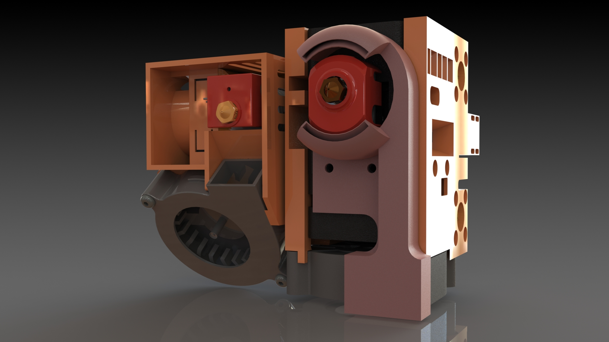
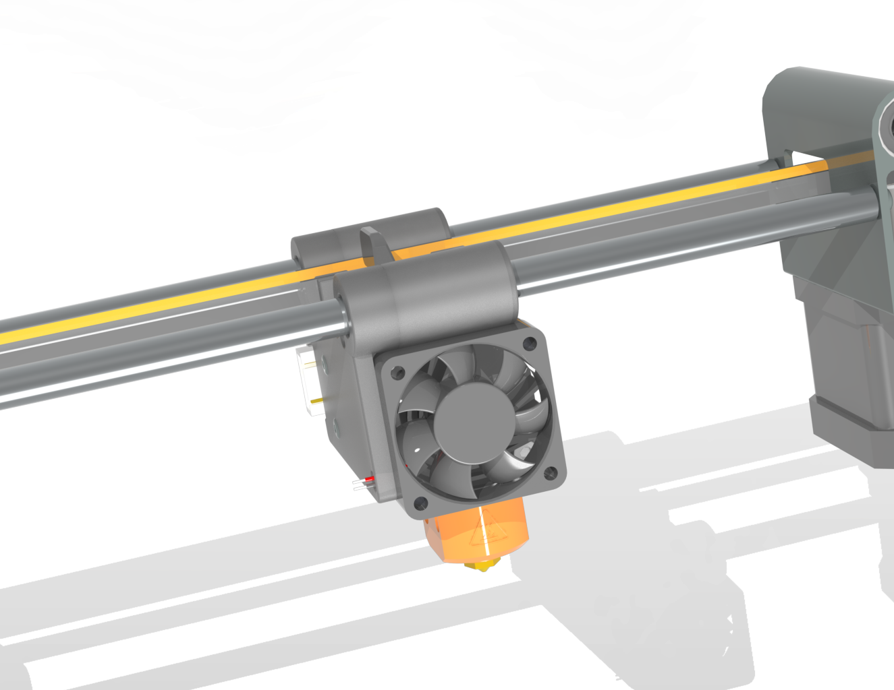
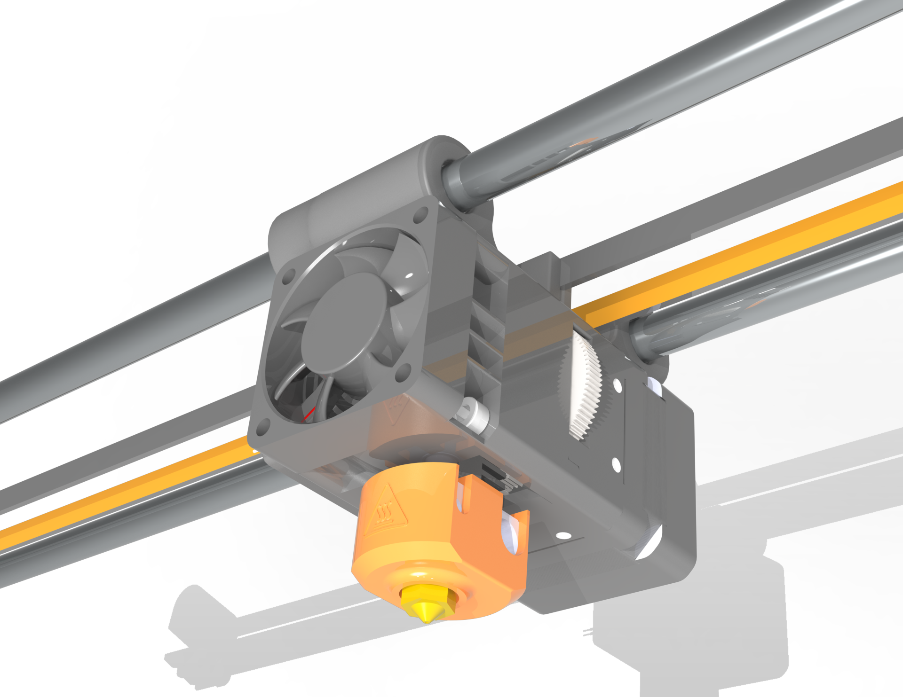

# Flying Bear Ghost 5 and Biqu H2 v2 direct extruder (version 0.1)

*stl/3mf 3d models*

# Version 0.2 (early revision)

Please note that finished parts have not been tested. Feel free to send me your version

The X-axis optical sensor is disabled. Use sensorless homing UART TMC2209 [Klipper](https://www.klipper3d.org/TMC_Drivers.html?h=sensorless#sensorless-homing) or use mechanical X-axis limit switch from filament end sensor [thingiverse](https://www.thingiverse.com/thing:4880501)

_files solidworks 2023_

